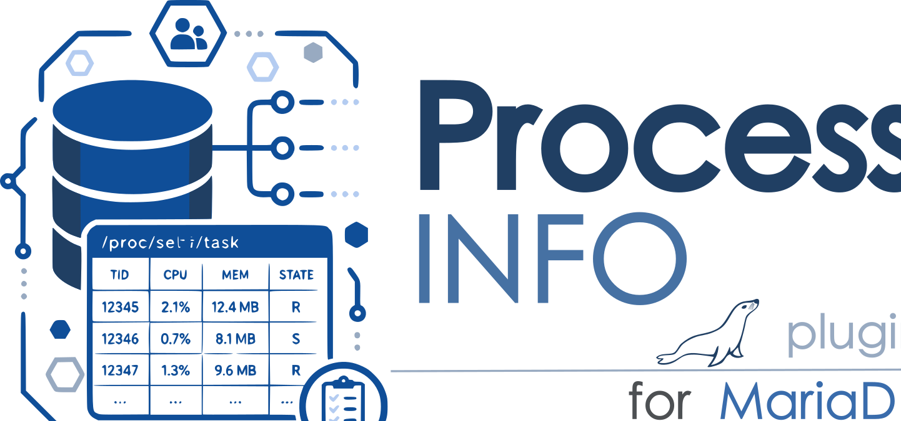

# mariadb-plugin-process-info



`PROCESS_INFO` is a read-only `INFORMATION_SCHEMA` plugin that reports Linux
`/proc/self/task` accounting for the MariaDB Server process. 

## Build and install

Add or link this directory as `plugin/process_info` in a MariaDB Server source
tree and enable it when configuring. The underscore is significant: MariaDB's
test runner only discovers plugin suites whose parent directory uses word
characters.

```sh
cmake -DPLUGIN_PROCESS_INFO=DYNAMIC <mariadb-source>
cmake --build . --target process_info
```

Install the resulting module in the server plugin directory, then run:

```sql
INSTALL SONAME 'process_info';
SELECT * FROM information_schema.PROCESS_INFO;
```

The querying account needs the global `PROCESS` privilege.

## Notes

Times are milliseconds and byte columns are bytes, including `RSS_BYTES`,
which is converted from Linux `/proc/[pid]/stat`'s resident-page count using
the process's runtime page size. I/O counters are returned as zero if the
kernel denies access to a task's `io` file. A task that exits while the
table is being read is safely skipped.

The parser handles spaces and parentheses in Linux thread names, bounds all
procfs reads, rejects malformed or overflowing numbers, follows no symlinks,
and does not retain a shared cross-session snapshot. `THREAD_NAME` is stored
with a binary charset so arbitrary bytes in a thread's Linux `comm` cannot
trigger silent charset-conversion mangling.

## Development

The procfs parsing logic lives in `process_info_parse.{h,cc}`, which has no
MariaDB server header dependency and can be built and unit tested outside a
MariaDB source tree:

```sh
g++ -std=c++11 -Wall -Wextra -o process_info_parse_test \
    process_info_parse.cc process_info_parse_test.cc
./process_info_parse_test
```

Inside a MariaDB build tree, the same binary is available as an
`EXCLUDE_FROM_ALL` CMake target:

```sh
cmake --build . --target process_info_parse_test
ctest -R process_info_parse_test
```
